# [Intro to Tidyverse](https://app.datacamp.com/learn/courses/introduction-to-the-tidyverse)


# 1 Data wrangling


## The gapminder dataset

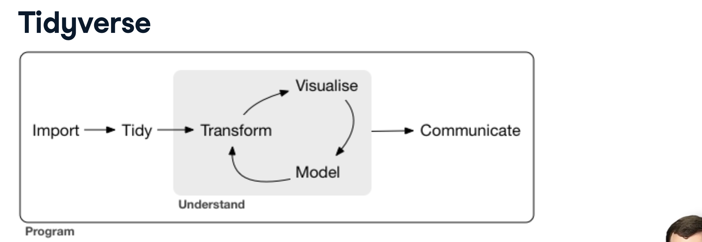
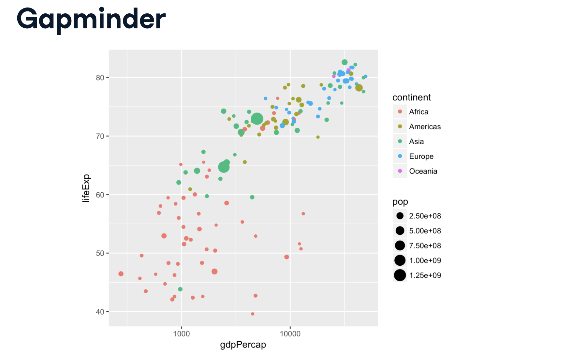
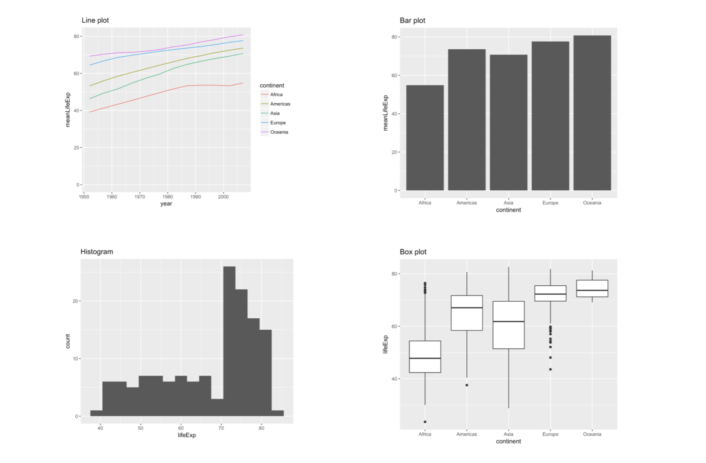

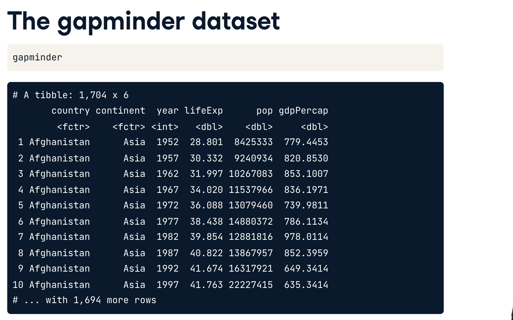

## Loading the gapminder and dplyr packages
```R
# Load the gapminder package
library(gapminder)

# Load the dplyr package
library(dplyr)

# Look at the gapminder dataset
gapminder

```
## Understanding a data frame
- how many rows in dataset?
```R
dim(gapminder)
```

## The filter verb


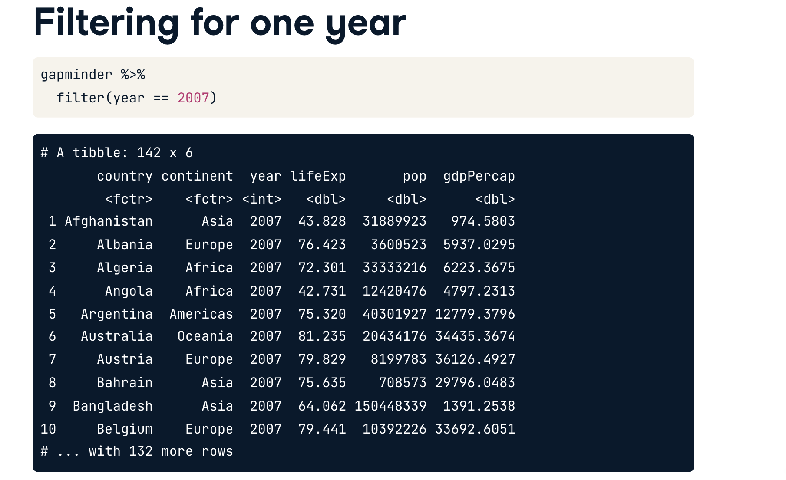
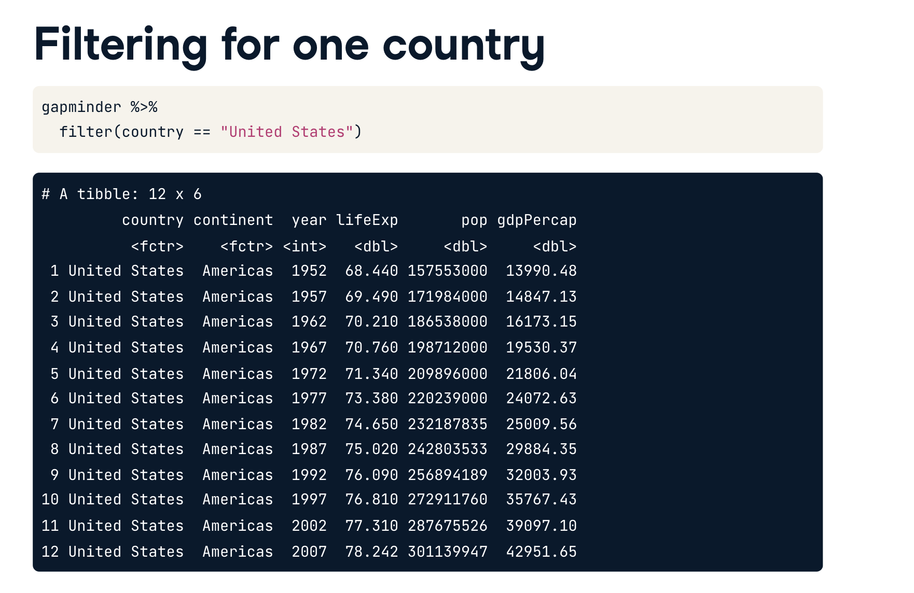
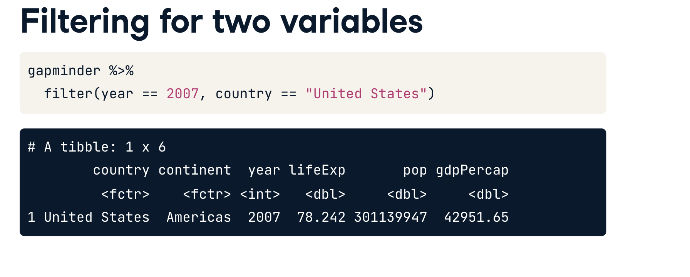
## Filtering for one year
```R
library(gapminder)
library(dplyr)

# Filter the gapminder dataset for the year 1957
gapminder %>%
  filter(year==1957)
```

## Filtering for one country and one year
```R
library(gapminder)
library(dplyr)

# Filter for China in 2002
gapminder %>%
  filter(country=="China", year==2002)
```

## The arrange verb

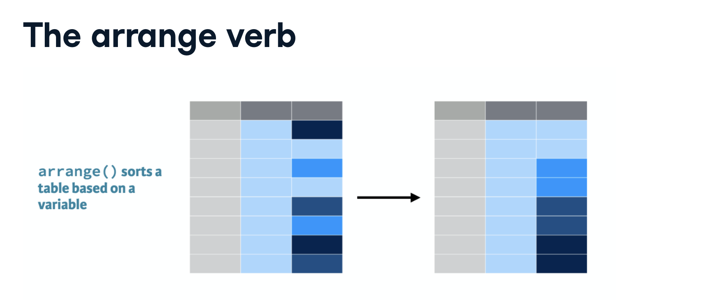
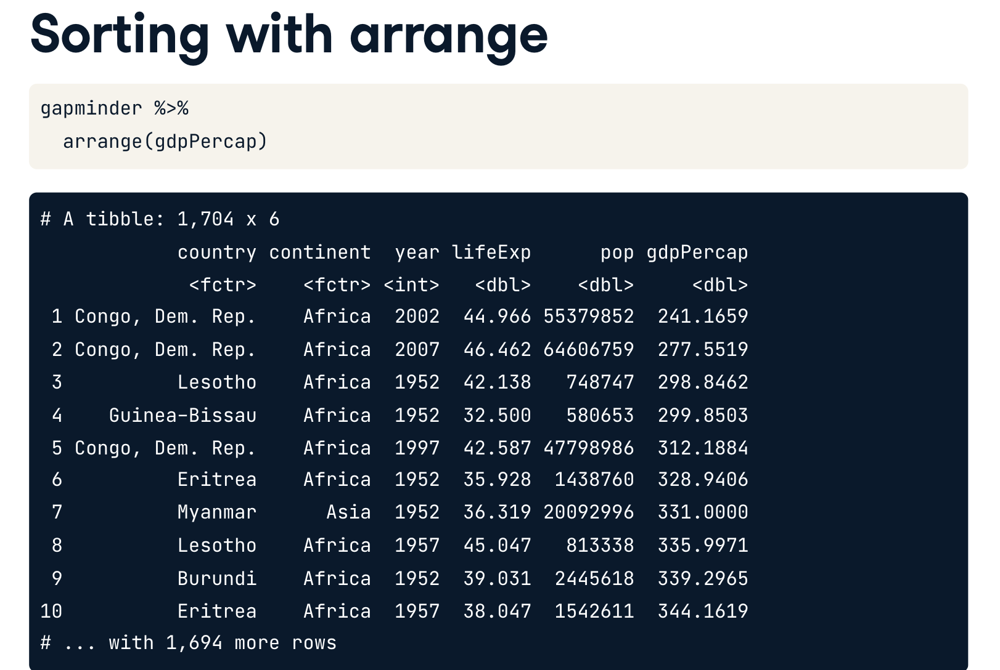
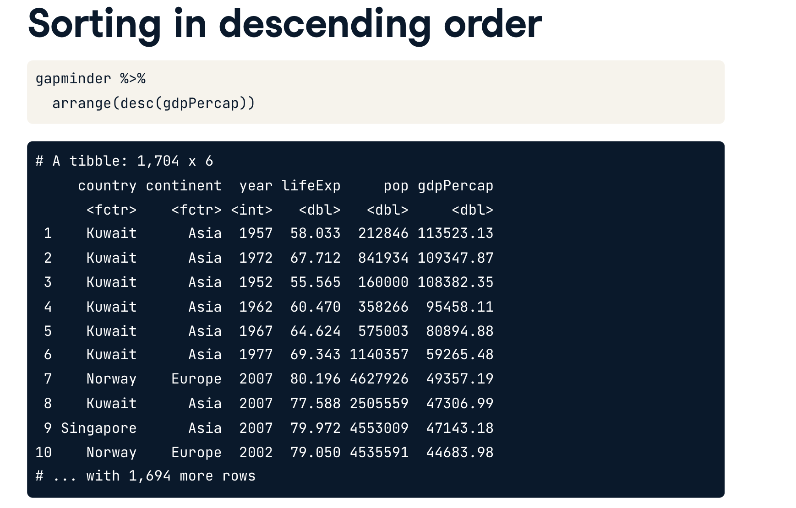
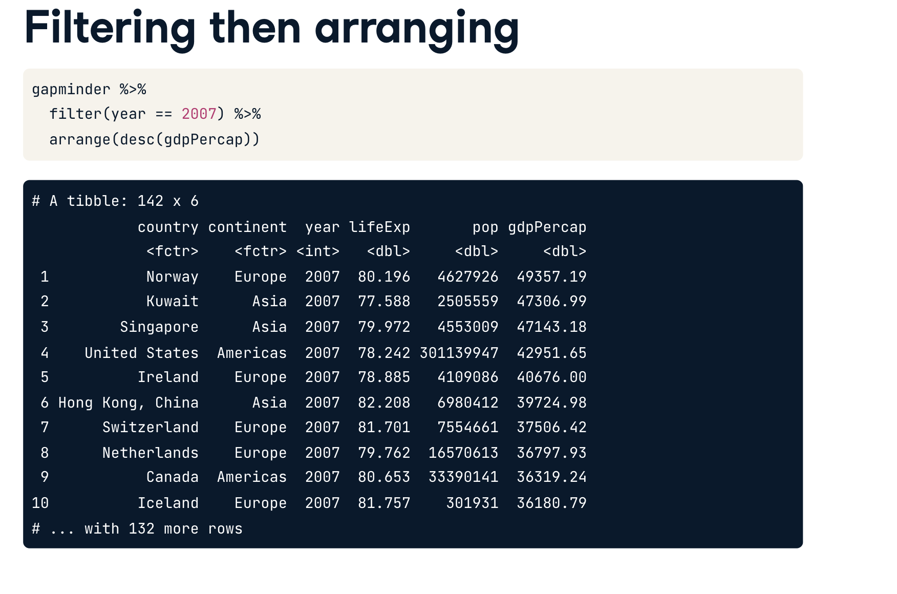

## Arranging observations by life expectancy
```R
library(gapminder)
library(dplyr)

# Sort in ascending order of lifeExp
gapminder %>%
  arrange(desc(lifeExp))

# Sort in descending order of lifeExp
gapminder %>%
  arrange(lifeExp)


```

## Filtering and arranging
```R
library(gapminder)
library(dplyr)

# Filter for the year 1957, then arrange in descending order of population
gapminder %>% filter(year==1957) %>% arrange(desc(pop))


```

## The mutate verb

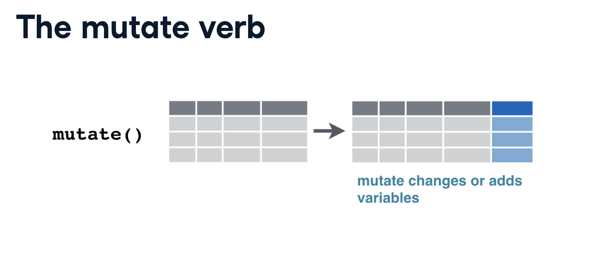
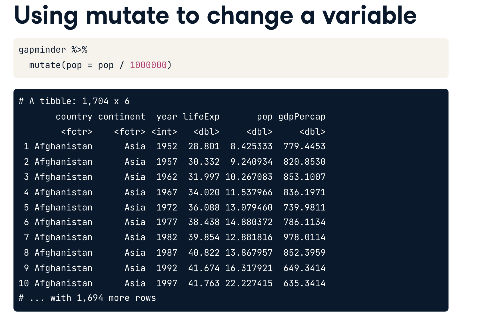
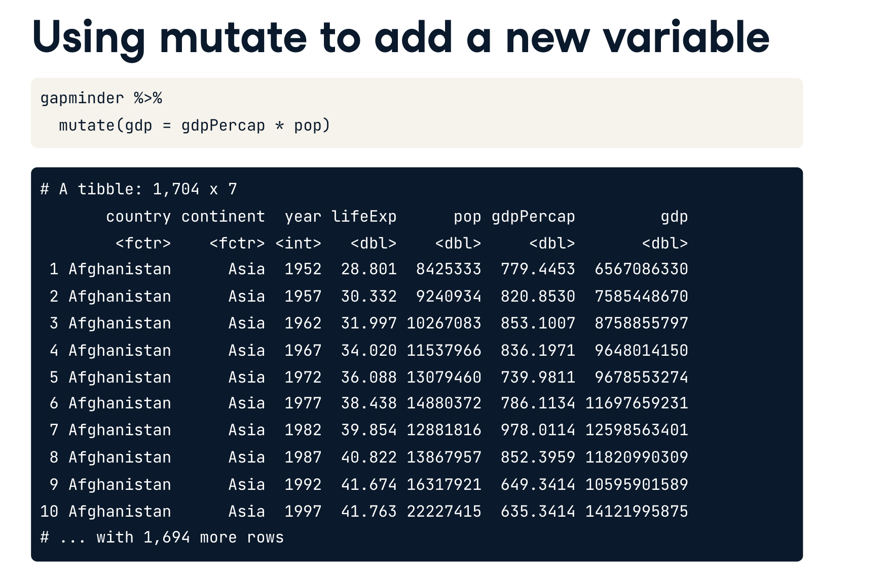
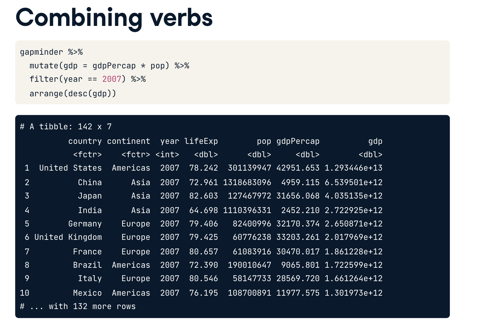

## Using mutate to change or create a column
```R
library(gapminder)
library(dplyr)

# Use mutate to change lifeExp to be in months
gapminder %>% mutate(lifeExp = lifeExp*12)

# Use mutate to create a new column called lifeExpMonths
gapminder %>% mutate(lifeExpMonths=lifeExp*12)
```

## Combining filter, mutate, and arrange
```R

library(gapminder)
library(dplyr)

# Filter, mutate, and arrange the gapminder dataset
gapminder %>% filter(year==2007) %>% mutate(lifeExpMonths=12*lifeExp) %>% arrange(desc(lifeExpMonths))


```


# 2 Data visualization


## Visualizing with ggplot2

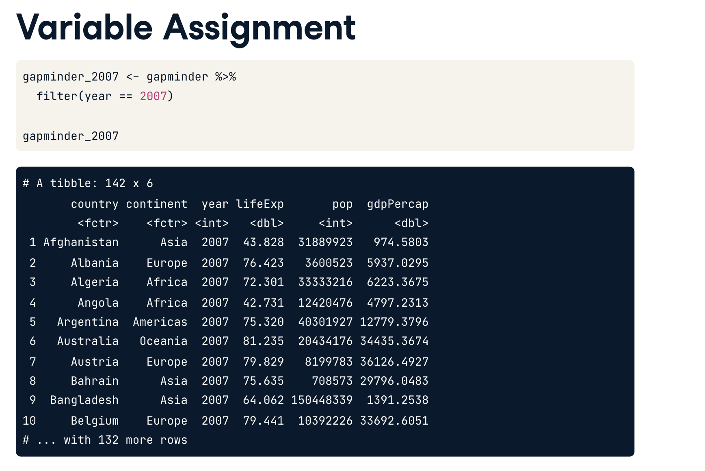

## Variable assignment

## Comparing population and GDP per capita

## Comparing population and life expectancy

## Log scales

## Putting the x-axis on a log scale

## Putting the x- and y- axes on a log scale

## Additional aesthetics

## Adding color to a scatter plot

## Adding size and color to a plot

## Faceting

## Creating a subgraph for each continent

## Faceting by year


# 3 Grouping and summarizing


## The summarize verb

## Summarizing the median life expectancy

## Summarizing the median life expectancy in 1957

## Summarizing multiple variables in 1957

## The group_by verb

## Summarizing by year

## Summarizing by continent

## Summarizing by continent and year

## Visualizing summarized data

## Visualizing median life expectancy over time

## Visualizing median GDP per capita per continent over time

## Comparing median life expectancy and median GDP per continent in 2007


# 4 Types of visualizations


## Line plots

## Visualizing median GDP per capita over time

## Visualizing median GDP per capita by continent over time

## Bar plots

## Visualizing median GDP per capita by continent

## Visualizing GDP per capita by country in Oceania

## Histograms

## Visualizing population

## Visualizing population with x-axis on a log scale

## Boxplots

## Comparing GDP per capita across continents

## Adding a title to your graph

## Conclusion

## Statement of Accomplishment
 

